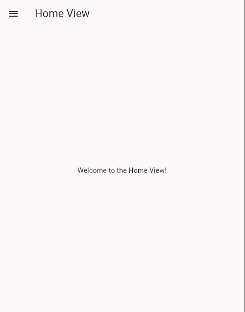
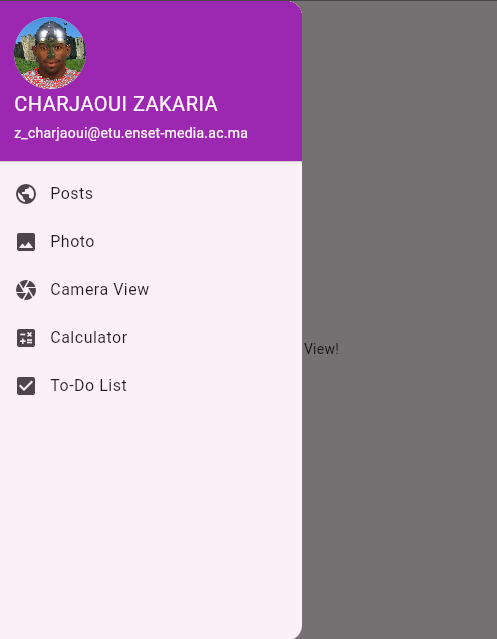
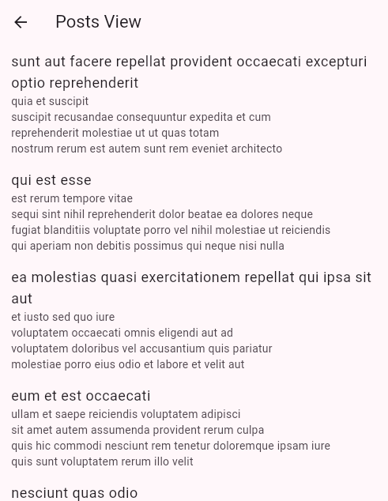
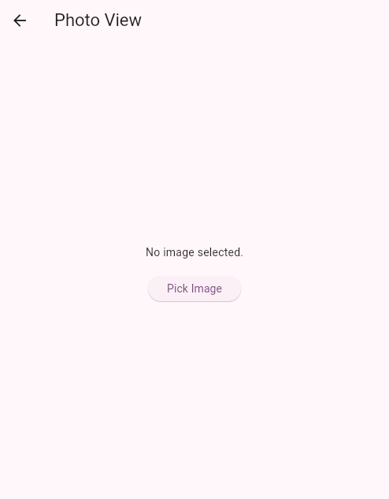
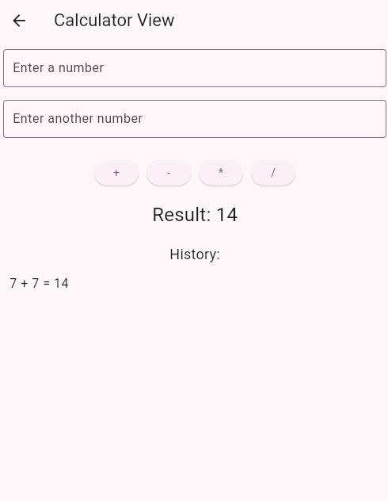
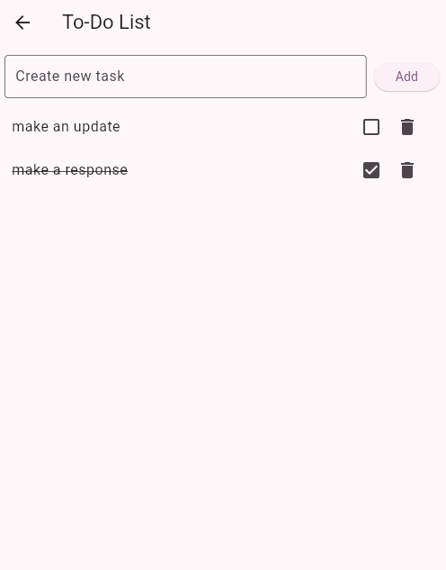

  <h3 align="center">First Flutter App</h3>

  

     Créer une application Flutter
  

   

  

    
    
  

## Captures d'écran

## Author

Charjaoui Zakaria - [Github](https://github.com/Zakry27)
