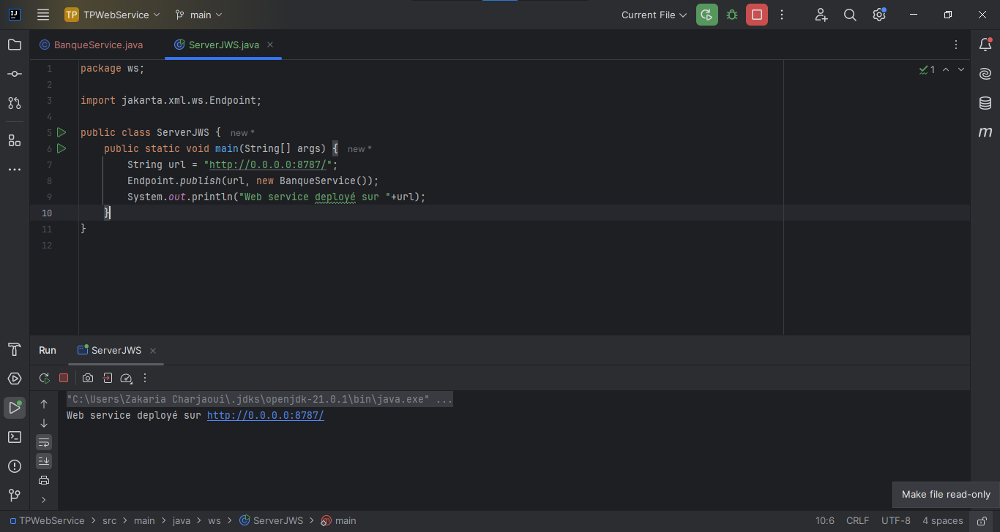
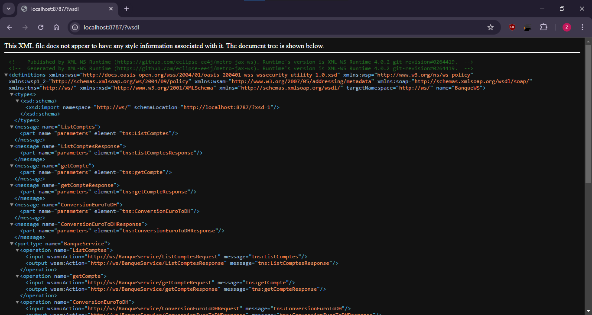
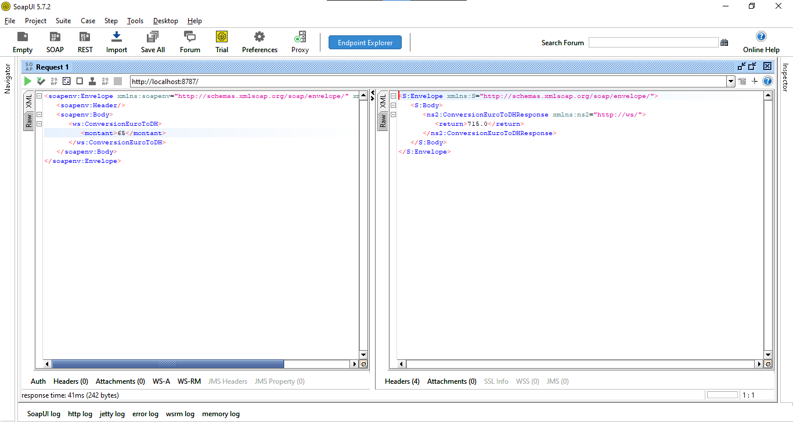
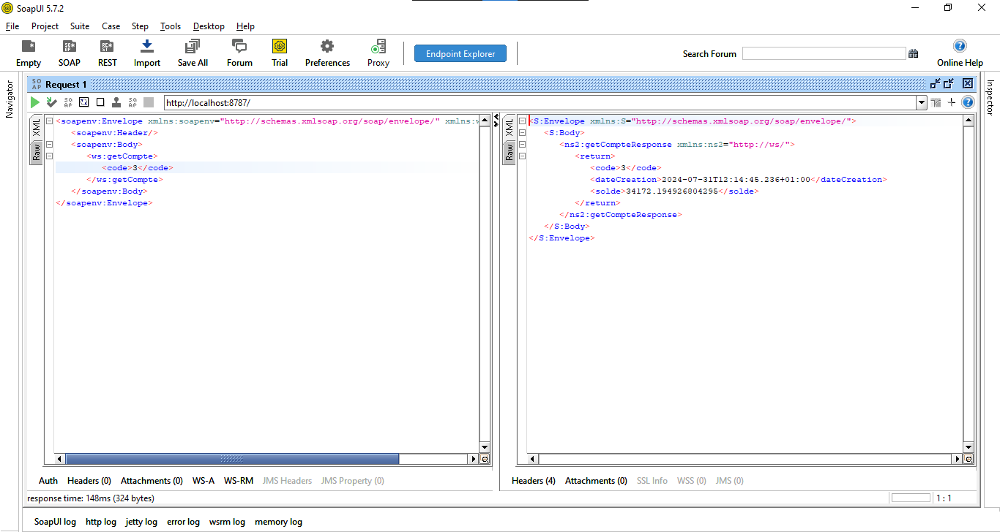
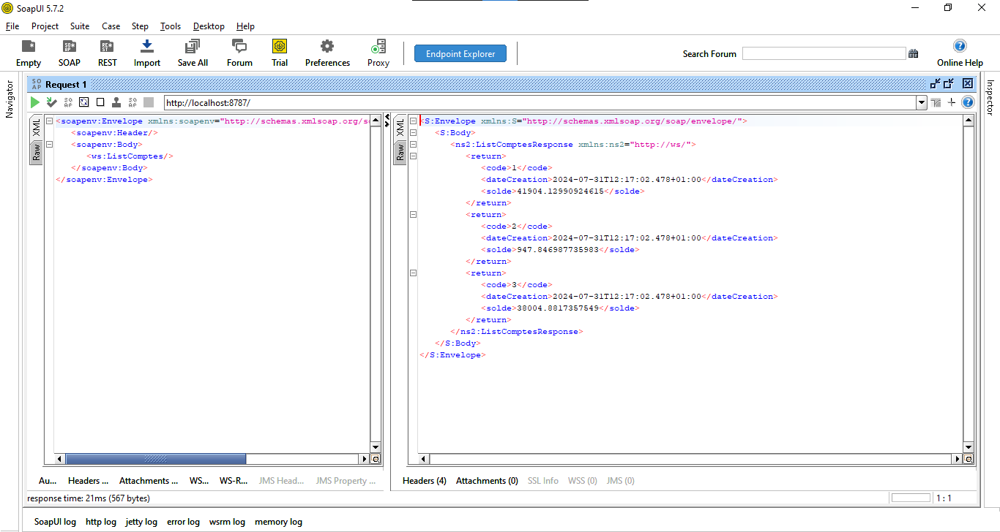

# Projet de Service Web Java (JaxWS)

## Aperçu
Ce projet Java illustre la mise en œuvre d'un service web simple en utilisant l'API Java pour les services web XML (JAX-WS).

## Captures d'écran

## Author
Charjaoui Zakaria - [Github](https://github.com/Zakry27)
